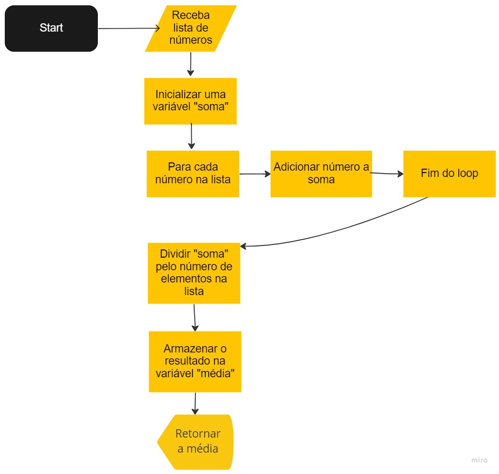

# Algoritmos

Algoritmos são conjuntos de passos lógicos e bem definidos para resolver um problema ou realizar uma tarefa específica. Eles são utilizados na computação para automatizar tarefas complexas e são a base para a construção de programas de computador.

Exemplo de algoritmo simples para calcular a média de umas lista de números:

1. Receba uma lista de números.
2. Inicialize uma variável para armazenar e somar os valores.
3. Adicione cada número da lista na variável soma.
4. Divida o valor da variável soma pela quantidade de elementos na lista.
5. Armazene o resultado da divisão em uma nova variável chamada média.
6. Retorne o valor da variável "média".

---

## Fluxograma

Um fluxograma é uma representação gráfica de um processo ou algoritmo, utilizado para representar de forma clara e concisa os passos e as decisões envolvidos em um processo. Eles são compostos por símbolos e setas que indicam o fluxo de informação ou decisão, e são usados para facilitar a comunicação e o entendimento de um processo.

